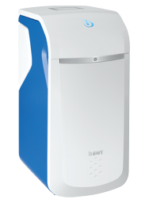

  

# BWT Perla Seta

  
Das Module liest die Daten der BWT Perla Seta interner Name 1IGO-RLU9 aus.

## Voraussetzungen

- BWT-Firmware >V2.02xx.
- Zugriffs Code  

Beides kann auf Anfrage beim BWT Support angefordert werden.  
In Deutschland per E-Mail an <ProfilineAS@bwt.de>.  
In der Schweiz per Wartungsanfrage über die BWT Support Site.  

Auf dem Geräte muss die lokae API aktiviert werden.  
Im Geräte Menu unter Verbindungen  

## Login Informationen

IP Adresse der BWT Seta im Feld IP Adresse eintragen.  
Den vom BWT Support mitgeteilete Zugriffscode im Feld Passwort eintragen.

## Diskusion und Fragen

## Change Log

### 1.0

-Initial Release
